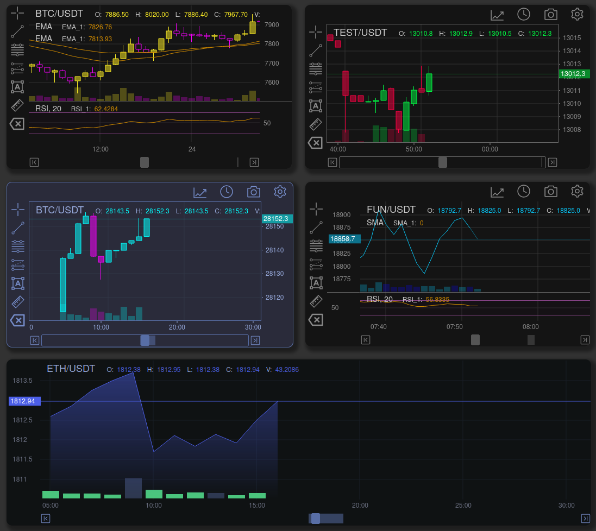

# README

XTrade is a highly customizable stock trade chart with **one** dependency written in plain JavaScript; use it with any framework or backend.



## Table of Contents

- [Demo](#demo)
- [Getting Started](#getting-started)
- [Documentation](/docs/documentation.md)
- [Features](#features)

## Getting Started

### Requirements

XTrade targets browsers that support [ECMAScript 2022](https://www.ecma-international.org/wp-content/uploads/ECMA-262_13th_edition_june_2022.pdfhttps:/).

## Install

### NPM

```
npm install xtrade-chart
```

### In Browser

```
<script src="xtrade-chart.es.js"></script>
```

## How to Use

Minimal working example:

```javascript
<div id="myChartDiv"></div>

<script>

import {Chart, DOM} from 'xtrade-chart'
import * as talib from "talib-web"

// minimal data state
let state = {
  "ohlcv": [
// [timestamp, open, high, low, close, volume]
    [1543579200000,4035.6,4072.78348726,3965,4055.6,2157.50135341],
    [1543582800000,4055.6,4100,4035,4059.1719252,1660.6115119],
    [1543586400000,4059.1,4076.6,4014.1,4060,1070.09946267],
    [1543590000000,4060.5,4060.5,3987.2,4049.2,1530.46774287],
    [1543593600000,4049.2,4092.7,4035,4089.6691106,922.84509291]
  ]
}

// minimal config
const config = {
  id: "XTrade",
  title: "BTC/USDT",
  width: 1000,
  height: 800,
  utils: {none: true},
  tools: {none: true},
  talib: talib,
  // see configuration.md#config regarding talib.wasm
  // `${window.location.origin}/talib.wasm`
  rangeLimit: 30,
}

const mount = document.getElementById('myChartDiv')
const chart = document.createElement("xtrade-chart")

mount.appendChild(chart)
chart.start(config)

</script>
```

## TypeScript

Types provided

## Framework Integration Examples

- [React / NextJS](nextjs)
- [Vue](https://github.com/xtrade-app/xtrade-Chart-Vue-JS)
- Svelte (TODO:)

## Features

- Plain JavaScript with no framework dependencies
- All chart features and functions accessible via [API](https://xtrade-app.github.io/xtrade-chart/api/core/)
- [State object](https://xtrade-app.github.io/xtrade-chart/reference/state/) defines [chart configuration](https://xtrade-app.github.io/xtrade-chart/reference/02_configuration/), [indicators](https://xtrade-app.github.io/xtrade-chart/reference/indicators_default/) and tools
- State can be [imported](https://https://xtrade-app.github.io/xtrade-chart/reference/state/#create-and-use-a-state) or [exported](https://xtrade-app.github.io/xtrade-chart/reference/state/#export) for storage and retrieval
- Indicator calculation provided by [talib-web](https://https://anchegt.github.io/talib-web/) as a WebAssembly module.
- [Custom Themes](https://xtrade-app.github.io/xtrade-chart/reference/themes/)
- [Custom Indicators](https://xtrade-app.github.io/xtrade-chart/reference/indicators_default/https:/)
- [Custom Overlays](https://xtrade-app.github.io/xtrade-chart/reference/overlays_custom/https:/)
- Custom Drawing Tools (to be implemented)
- [Event Hub](https://xtrade-app.github.io/xtrade-chart/reference/events/) - subscribe to chart events
- Rendering Optimization - smooth performance
- High frequency chart candles updates
- [Export chart to png, jpg](https://xtrade-app.github.io/xtrade-chart/reference/api-examples/#download-image), webp, with optional watermarking
