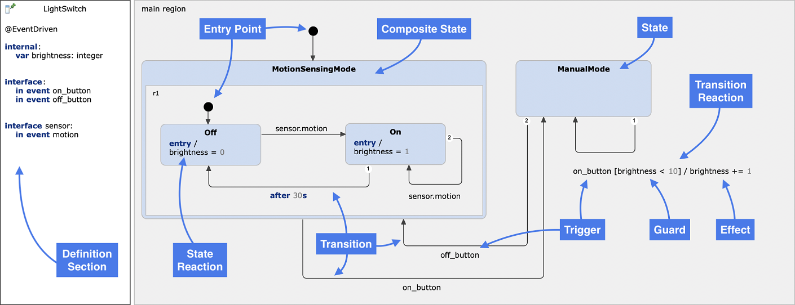

# TradeXChart


### v0.0.0

TradeXChart follows [breaking].[feature].[fix] versioning

**Hook Observer Pattern**
An extensible API like WordPress
making it easy for third party programmers to write extensions to the core

**Aspect-Oriented Programming**
Code injection
into existing functions or objects, without modifying the target logic.

**State Machine**
Logical state management
providing a behaviour model describing the states the system can be in and the conditions by which one transitions to another.

**Global Store**

**Event Hub**

**Scalable Application Architecture**
Decoupled, event-driven architecture

**Model Contoler View**

## Aspect-Oriented Programming

Code injection

[https://en.wikipedia.org/wiki/Aspect-oriented_programming](https://en.wikipedia.org/wiki/Aspect-oriented_programming)

### Meld

[https://github.com/cujojs/meld](https://github.com/cujojs/meld)

## State Machine

Logical state management



[https://www.itemis.com/en/yakindu/state-machine/documentation/user-guide/quick_ref](https://www.itemis.com/en/yakindu/state-machine/documentation/user-guide/quick_ref)

## Scalable Javascript Applicaton Architecture

decoupled, event-driven architecture

The features of the architecture are decoupled, allowing for flexible and extensible applications. The application is broken down into the following parts:

* Modules (sandboxed)
* Mediator (API)
* Application Core (Plugins, Base Libraries)


#### Module

Modules are single-purpose parts of a larger system that are interchangeable. They are classes which will be instantiated with a Mediator which will sand box them.

References: [1]

#### Sandbox

A Sandbox is a module instance created with the Mediator, which presents a siloed API of the Core for the Module. None of the modules can directly mutate each other or the Core.

The Sandbox uses a [Facade](#facade) [2] and [Mediator](#mediator<a id="application-core"></a>) [3] pattern.

Modules can interact with the Core and each other via the Mediator which has inheirited a specific methods and properties ([Facade](#facade)) from the Core.

#### Mediator

The Mediator can be thought of as a customized API for the Core (Facade).

#### <a id="application-core"></a>Core

The Core is responsible for starting and stopping the modules. It also handles the messages by using the [Publish/Subscribe (Mediator) pattern](https://en.wikipedia.org/wiki/Publish%E2%80%93subscribe_pattern).

#### Plugins

Plugins extend or mofify the functionality of the Core.

### Design Patterns

#### <a id="facade"></a>Facade

The Facace is a unifying (simplified) API for the [Application Core](#application-core).

It serves as an **abstraction** of the application core which sits between the mediator and our modules - it should ideally be the **only** other part of the system modules are aware of.

In that way you can hide the features provided by the core and only show a well defined custom static long term API to your modules.

References: [2]

#### <a id="mediator"></a>Mediator

A mediator **encapsulates** how disparate modules **interact**
with each other by acting as an intermediary. The pattern also promotes
loose coupling by preventing objects from referring to each other
explicitly - in our system, this helps to solve our module
inter-dependency issues.

It provides the Facade to Module, by extending the Module class.

Refrences: [3]

# Modules

## Module Template

```javascript
export default class UtilsBar {

  #modID                 // required - set by the Core
  #name = "Utilities"    // required
  #shortName = "utils"   // required
  #mediator              // required
  #options               // required

  // user defined properties follow...

  // required - can be empty
  constructor (mediator, options) {

    this.#mediator = mediator
    this.#options = options
    this.init()
  }

  // suggested
  log(l) { this.#mediator.log(l) }
  info(i) { this.#mediator.info(i) }
  warning(w) { this.#mediator.warn(w) }
  error(e) { this.#mediator.error(e) }


  init() {
    this.mount(this.#elUtils)
  }

  // required
  start() {
    // Start the module's activities.
    // Play time!
  }

  // required
  end() {
    // Stop and clean up the module to prevent memory leaks.
    // It should remove: event listeners, timers, ect.
    // Put your toys away or it will end in tears.
  }

  // required
  get name() {return this.#name}
  // required
  get shortName() {return this.#shortName}
  // required
  get mediator() {return this.#mediator}
  // required
  get options() {return this.#options}

  // recommended
  on(topic, handler, context) {
    this.#mediator.on(topic, handler, context)
  }

  // recommended
  off(topic, handler) {
    this.#mediator.off(topic, handler)
  }

  // recommended
  emit(topic, data) {
    this.#mediator.emit(topic, data)
  }
}

```

# References

1. [Modlule - https://addyosmani.com/largescalejavascript/#modpattern](https://addyosmani.com/largescalejavascript/#modpattern)
2. [Facade - https://addyosmani.com/largescalejavascript/#facadepattern](https://addyosmani.com/largescalejavascript/#facadepattern)
3. [Mediator - https://addyosmani.com/largescalejavascript/#mediatorpattern](https://addyosmani.com/largescalejavascript/#mediatorpatternhttps:/)
4.

---

# Advanced Mark Down

[https://stackedit.io/app#](https://stackedit.io/app#)

## SmartyPants

SmartyPants converts ASCII punctuation characters into "smart" typographic punctuation HTML entities. For example:


|                  | ASCII                           | HTML                          |
| ------------------ | --------------------------------- | ------------------------------- |
| Single backticks | `'Isn't this fun?'`             | 'Isn't this fun?'             |
| Quotes           | `"Isn't this fun?"`             | "Isn't this fun?"             |
| Dashes           | `-- is en-dash, --- is em-dash` | -- is en-dash, --- is em-dash |

## KaTeX

You can render LaTeX mathematical expressions using [KaTeX](https://khan.github.io/KaTeX/):

The *Gamma function* satisfying $\Gamma(n) = (n-1)!\quad\forall n\in\mathbb N$ is via the Euler integral

$$
\Gamma(z) = \int_0^\infty t^{z-1}e^{-t}dt\,.

$$

> You can find more information about **LaTeX** mathematical expressions [here](http://meta.math.stackexchange.com/questions/5020/mathjax-basic-tutorial-and-quick-reference).

## UML diagrams

You can render UML diagrams using [Mermaid](https://mermaidjs.github.io/). For example, this will produce a sequence diagram:

```mermaid
sequenceDiagram
Alice ->> Bob: Hello Bob, how are you?
Bob-->>John: How about you John?
Bob--x Alice: I am good thanks!
Bob-x John: I am good thanks!
Note right of John: Bob thinks a long<br/>long time, so long<br/>that the text does<br/>not fit on a row.

Bob-->Alice: Checking with John...
Alice->John: Yes... John, how are you?
```

And this will produce a flow chart:

```mermaid
graph LR
A[Square Rect] -- Link text --> B((Circle))
A --> C(Round Rect)
B --> D{Rhombus}
C --> D
```
