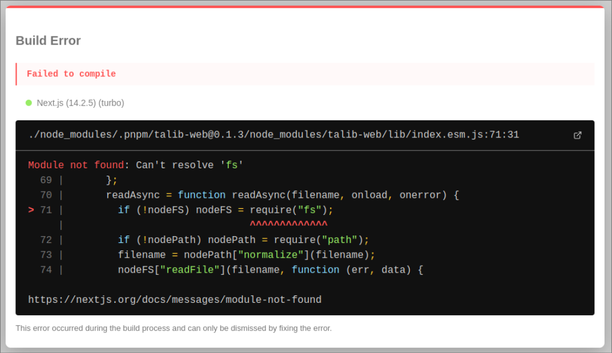

## TALib-web NextJS fs

This bug report addresses an issue encountered when running Trade-X charts in a Next.js environment (versions 13 and 14) using Turbopack. The problem arises due to the absence of the fs module on the client side and Turbopack's initial failure to respect the "browser": { "fs": false } flag in the package.json file. This report provides an updated solution to the problem by configuring Turbopack to ignore the fs module using a custom alias.



**What is Turbopack?**
Turbopack is a modern bundler designed to be a successor to Webpack, offering faster build times and improved performance, particularly for large projects. It aims to provide a more efficient development experience by leveraging Rust's performance and optimizations.

**Problem Description**
When running Trade-X charts in a Next.js application with Turbopack, the build process fails due to attempts to bundle the fs module, which is not available in the browser environment. This issue does not occur when using Webpack, as Webpack allows developers to specify certain modules to be ignored on the client side through the package.json file:

```javascript
"browser": {
  "fs": false
}
```

This flag tells Webpack to replace any usage of the fs module with an empty module on the client side, preventing the bundler from including it in the client-side bundle. However, Turbopack currently does not respect this flag, leading to errors during the build process.

**Updated Solution**
To make Turbopack work correctly and avoid bundling the fs module on the client side, you can configure a custom alias in the Next.js configuration. This involves creating a fake fs module and aliasing it in the Turbopack configuration.

1. Create a Fake fs Module:

Create a folder called custom-modules and inside it, create a file named fake-fs.js with the following content:

```javascript
module.exports = {};
```

2. Configure Turbopack to Use the Fake fs Module

Update your next.config.mjs file to include the custom alias for the fs module:

```javascript
experimental: {
    turbo: {
      resolveAlias: {
        fs: { browser:'./custom-modules/fake-fs.js' }
      },
    },
  },
```
