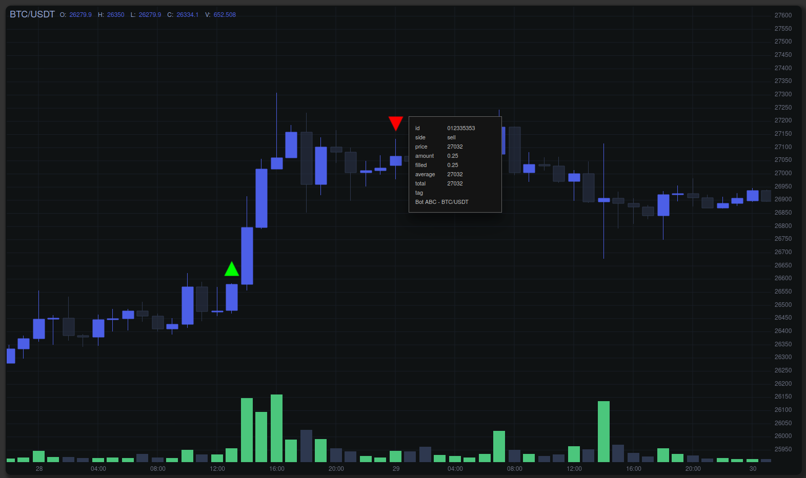

Trade makers representing buy or sell orders, are placed on the primary chart pane, above the individual price history intervals (candles) they are associated with via their timestamp.



TradeX Chart provides a number of marker icon options, their size and colour are configurable. [Trades Settings](#trades-settings) has more details.

## Toggling Trade Markers


## Trade Order Data Entries

An individual trade entry has the following format:

```javascript
const trade = {
  timestamp: 1558605600000, // number - time stamp
  id: "012336352",          // string - trade id
  side: "buy",              // string - buy or sell
  price: 7590,              // number
  amount: 0.25,             // number
  filled: 0.25,             // number
  average: 7845,            // number
  total: 1961,              // number
  tag: "Bot ABC - BTC/USDT" // string - user defined identifier
}
```

## Add Trade

A single trade can be added to the chart data state via the following:

```javascript
chart.addTrade(trade)
```

Where the [trade entry object format](#trade-entry) is defined in the previous section. ``addTrade()`` will validate the trade entry and return a boolean as the result.

## Remove Trade

Not implemented yet.

## Trade State Data

The [chart State Data](../state) provides a collection of all of the trades that can be displayed on the chart.

The trades are represented by an object in the ``primary`` chart pane of the data state.

The trades object requires the following to be valid:


| Property | Type   | Description                                |
| ---------- | -------- | -------------------------------------------- |
| name     | string | "Trades"                                   |
| type     | string | "trades"                                   |
| settings | object | [define how trades are displayed](#trades-settings) |
| data     | array  | [trade entries](#trade-data-trade-entries) |

### Trades Settings

The default trade settings are as follows

```javascript
{
  // icons must be in SVG format
  iconBuy: tradeIcons.arrowUp,
  iconSell: tradeIcons.arrowDown,
  iconHeight: 30,
  iconWidth: 30,
  iconMinDim: 10,
  buyColour: "#0f0",
  sellColour: "#f00",
  offset: 10
}
```
Icons are expected to be in SVG format.

### Trades Data - Trade Entries

[Trade entries (objects)](#trade-entry) are grouped by timestamp in an array as it may be possible that multiple trades may be executed on the same time interval (candle).

```javascript
const config = {
ohlcv: [],
primary: [
  {
    "name": "Trades",
    "type": "trades",
    "settings": {
      // see above example for all options
    },
    data: {
      1695906000000: [
          {
            timestamp: 1695906000000,
            id: "012336352",
            side: "buy",
            price: 27032,
            amount: 0.25,
            filled: 0.25,
            average: 27032,
            total: 27032,
            tag: "Bot ABC - BTC/USDT"
          }
        ],
        1695945600000: [
          {
            timestamp: 1695945600000,
            id: "012335353",
            side: "sell",
            price: 27032,
            amount: 0.25,
            filled: 0.25,
            average: 27032,
            total: 27032,
            tag: "Bot ABC - BTC/USDT"
          }
        ],
        1696327200000: [
          {
            timestamp: 1696327200000,
            id: "012335354",
            side: "sell",
            price: 27550.6,
            amount: 0.25,
            filled: 0.25,
            average: 27550.6,
            total: 27550.6,
            tag: "Bot ABC - BTC/USDT"
          }
        ]
      }
  }
],
secondary: [],
}
```

## Trade Marker Event

By default, if a trade marker is clicked, it will invoke the trades overlay method which will display the trade data over the chart.

This can be disabled via the [chart config](../../02_configuration).

```javascript
const config = {
  trades: { 
    display: true,
    displayInfo: false 
  }
}
```

The chart emits a ``trade_selected`` [event](../../events) which you can subscribe to and invoke your own method.

The event will pass the information for that [trade entry](#trade-entry) to the subscribed event listener.
